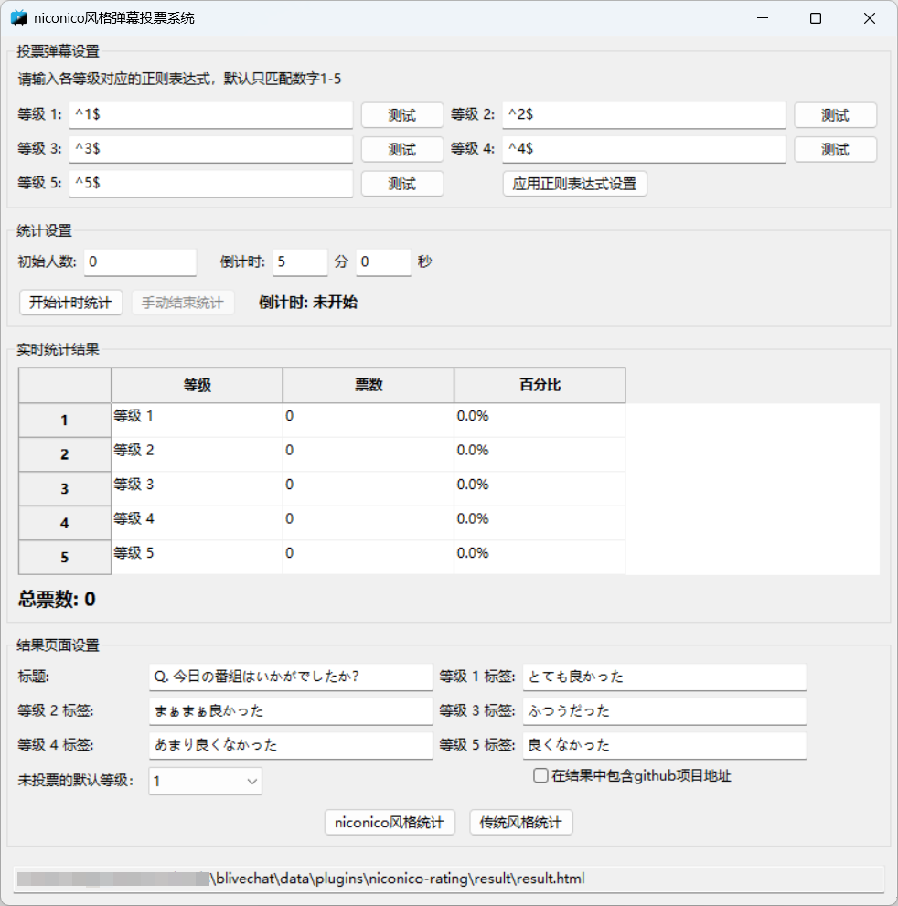

# niconico风格弹幕投票系统

为blivechat实现类niconico风格的弹幕投票统计功能。

## 使用方法

1. 下载[release](https://github.com/KingRayCao/blivechat-niconico-rating/releases)中的`niconico-rating.zip`，将其解压到blivechat的`data/plugins`目录下（请确保`niconico-rating`目录下没有再嵌套一层`niconico-rating`目录）。如图：

2. 启动blivechat，此时投票GUI界面会自动启动。为防止误操作，此界面不能被手动关闭。当blivechat关闭时，投票GUI也会自动关闭。

3. 请确保blivechat浏览器控制页面中`高级`选项卡下的`通过服务器转发消息`处于开启状态。如图：

4. 完整的投票GUI界面如下：

   1. **投票弹幕设置**：可以在此处通过正则表达式设置怎样的弹幕内容会被视作投票。
      - 留空文本框：使用默认值（只匹配数字1-5）
      - 输入自定义正则表达式（注意匹配优先级从高到低）。点击测试按钮测试正则表达式是否合法，点击设置按钮使正则表达式生效
   2. **统计设置**：在这里设置番剧开播时的初始人数。点击`开始统计`按钮清空之前的数据，并开始收集投票。点击`结束统计`按钮停止收集。注意：一个账号只取他投的**第一张有效票**
   3. **实时统计结果**：实时显示各等级实际投票数量和百分比，以及总票数
   4. **结果页面设置**：可以设置结果页面的标题，以及是否包含本项目的github地址
      - 点击`niconico风格统计`，会按照niconico风格进行统计结果展示。即：第2-5等级的人数按照实际投票结果展示，等级1的人数按照 $max(初始人数，总票数)-\sum _{i=2}^5第i等级投票人数$ 展示
      - 点击`传统风格统计`，各等级人数按照实际票数展示
   5. **统计结果的URL**显示在最下方，此URL只与blivechat的绝对路径有关。到OBS中添加`浏览器源`，填入此URL。设置参考如图。OBS添加完后，统计结果如果有更新，则需要在OBS的浏览器源中**手动刷新一下**。
   

1. 关闭blivechat后，投票GUI会自动关闭。

## 自定义正则表达式示例

- **精确匹配**: `^鬣狗$` (仅匹配“鬣狗”，不匹配“鬣狗1”或“1鬣狗”)
- **包含匹配**: `鬣狗` (匹配包含“鬣狗”的任何弹幕)
- **选择匹配**: `^(诶嘿|呜哇)$` (匹配“诶嘿”或“呜哇”)
- **范围匹配**: `^[1-5]$` (匹配1到5的任意数字)
- 其他需求可以直接去问AI

## 参考
参考：[blivechat](https://github.com/xfgryujk/blivechat)
